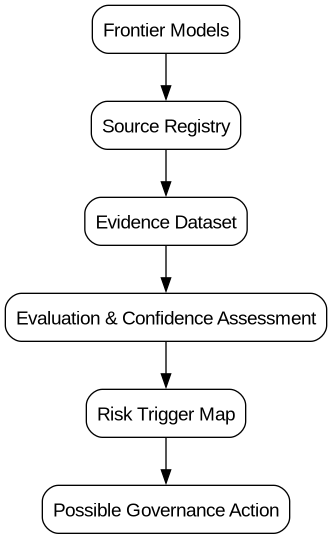

# Frontier Model Risk Trigger Map

[](https://github.com/G-BUZZ/frontier-model-risk-trigger-map/releases)
[](LICENSE)
[](CITATION.cff)


## Research Project

Created and maintained by Giulio Buzzetta.

This project explores how legal reasoning, security analysis and open-source research methods can contribute to frontier AI governance.

The objective is to build a reproducible evidence-to-governance workflow connecting:

Evidence  
→ Evaluation  
→ Confidence Assessment  
→ Risk Trigger  
→ Possible Governance Action

An open-source, evidence-first repository that collects and structures public system cards, model cards, government testing and independent evaluations of frontier AI models, then maps the evidence to **possible regulatory or supervisory actions**.

> **Status:** research prototype, v1.0.0. It is not a legal determination, a certification of safety, or a complete assessment of any provider.


## Evidence-to-Governance Pipeline



The project follows a reproducible workflow:

Models  
→ Sources  
→ Evidence  
→ Evaluation  
→ Confidence Assessment  
→ Governance Triggers

## Why this project exists

Frontier-model disclosures use different taxonomies, benchmarks, scaffolds, access conditions and thresholds. Directly ranking models can therefore create false precision. This project instead records each claim as a traceable evidence unit and asks a narrower policy question:

**What additional action is justified by the evidence currently available, and how confident can a public authority be in that conclusion?**

The project deliberately avoids a single composite “safety score”. It produces domain-specific triggers for:

- additional testing;
- qualified independent evaluation;
- restricted or identity-gated access;
- enhanced monitoring and serious-incident assessment;
- deployment review or corrective measures.


## Key Outputs

The project currently provides:

- frontier model registry;
- evidence tracking dataset;
- evaluation metadata;
- risk trigger mapping;
- governance case studies;
- reproducible analysis workflow.

## Initial scope

The seed dataset covers selected public materials available by **2026-08-04** for OpenAI GPT-5.6 Sol, Anthropic Claude Opus 4.8, Google Gemini 3.1 Pro and xAI Grok 4.5, with Grok 4.20 retained as a historical checkpoint, plus cross-model evidence from METR, the UK AI Security Institute and Apollo Research. Coverage is intentionally incomplete and should not be interpreted as a ranking of these models or providers.

Risk domains:

1. cyber capabilities and safeguards;
2. biological and chemical capabilities;
3. autonomous operation and AI R&D acceleration;
4. harmful persuasion and manipulation;
5. agentic behaviour, deception, scheming and evaluation integrity;
6. deployment exposure and critical-infrastructure relevance.

## Research Materials

- [Methodological Limitations](docs/limitations.md)


## Research Status

This project is an open-source research prototype.

Current work focuses on:

- structuring frontier AI evidence;
- tracking evaluation uncertainty;
- connecting capability signals with governance triggers;
- improving reproducible analysis workflows.

Future iterations will focus on:

- expanding independent evaluation coverage;
- adding historical trend analysis;
- improving evidence provenance;
- incorporating additional governance case studies.

The project is intended as a research and analysis tool, not as a certification system or a definitive assessment of model safety.

## Repository structure

```text
config/                    Taxonomy and decision rules
data/models/               Model and deployment metadata
data/sources/              Source registry and provenance
 data/evidence/            One claim or result per row
 data/incidents/           Public incident records
 data/derived/             Generated normalized outputs
docs/                      Methodology, threat model and policy products
src/frontier_trigger_map/  Standard-library Python package
tests/                     Validation and rule-engine tests
outputs/                   Generated trigger map
```

## Quick start on Fedora Kinoite

Use Toolbx rather than layering a development stack onto the immutable host:

```bash
toolbox create frontier-risk
toolbox enter frontier-risk
sudo dnf install -y git python3 make pandoc

git clone https://github.com/G-BUZZ/frontier-model-risk-trigger-map.git
cd frontier-model-risk-trigger-map
make validate
make build
make test
```

The project has no runtime Python dependencies outside the standard library. `pandoc` is optional and only needed to render the policy documents.

## Commands

```bash
make validate     # validate identifiers, required fields and references
make build        # generate outputs/trigger_map.csv and .md
make test         # run the standard-library unit tests
make brief        # render policy brief and executive summary to HTML
make clean        # remove generated files
```

Equivalent Python commands:

```bash
python -m frontier_trigger_map.cli validate
python -m frontier_trigger_map.cli build
```

## Methodological safeguards

- **No absence-of-evidence inference:** a missing result never becomes a reassuring result.
- **No automatic cross-benchmark normalization:** scores are retained in their original unit and context.
- **Provider claims remain provider claims:** commissioned or internal evaluations are not relabelled as independent.
- **Deployment matters:** capability evidence is interpreted alongside access, safeguards, tool use and exposure.
- **Triggers are rebuttable:** every generated action includes a reason and confidence level.
- **Version pinning:** model checkpoint, evaluation version, date and source status are recorded where known.

## Core outputs

- `outputs/trigger_map.csv`: machine-readable model-domain-action matrix.
- `outputs/trigger_map.md`: human-readable trigger map.
- `docs/policy_brief.md`: 8–12 page equivalent policy briefing in English.
- `docs/executive_summary_eu_ai_office.md`: one-page summary for the EU AI Office.


## Research Motivation

This project was created to explore how legal, security and open-source research methods can contribute to frontier AI governance.

The goal is not to predict whether advanced AI systems are safe or unsafe.

The goal is to build a reproducible workflow that connects:

- publicly available evidence;
- evaluation limitations;
- uncertainty analysis;
- governance decision points.

The project reflects an interdisciplinary approach combining:

- legal reasoning;
- security risk analysis;
- open-source intelligence methods;
- evidence-based policy research.

## Current Research Direction

Future work focuses on:

- expanding independent evaluation coverage;
- improving evidence provenance;
- analysing governance thresholds;
- connecting frontier model capabilities with proportionate oversight mechanisms.


## Research Materials

- [Research Statement](docs/research_statement.md)
- [Research Portfolio](docs/portfolio.md)
- [Case Studies](docs/case_studies/README.md)
- [Frontier AI Governance Direction](docs/frontier_ai_governance_direction.md)

## Licensing

Code is licensed under the MIT License. Original documentation and structured data are made available under CC BY 4.0 unless a source imposes different terms. Source documents remain subject to their original licences and are linked rather than redistributed.

## Research integrity

This repository is designed for reproducible public-interest research. It does not contain dangerous procedural content, model weights, private evaluation data or instructions for offensive use. Contributions should record both concerning and reassuring evidence and disclose conflicts, funding and evaluator access constraints.

## Architecture

The project follows an evidence-to-governance pipeline:

```text
Frontier Models
        |
        v
Source Registry
        |
        v
Evidence Dataset
        |
        v
Evaluation Registry
        |
        v
Evidence Confidence Assessment
        |
        v
Risk Trigger Map
        |
        v
Decision Framework
        |
        v
Governance Report
```
## Research Principles

The project follows five principles:

- No universal risk scoring;
- Separation between provider claims and independent evaluations;
- Explicit uncertainty tracking;
- Human review before governance decisions;
- Reproducible evidence pipelines.

## Outputs

The repository generates:

- trigger maps;
- evidence summaries;
- governance reports;
- structured evaluation records.
